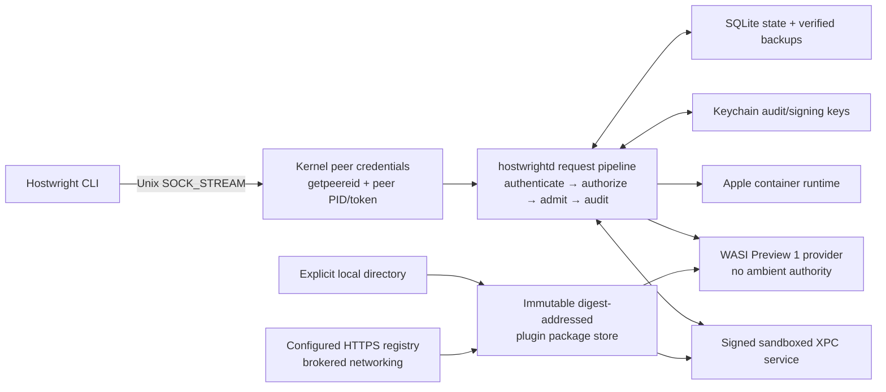

# Phase 09 Threat Model

Status: Gate 1 security design input. This is a repository-grounded threat
model for the frozen Phase 09 contracts, not evidence that a control socket,
RBAC, provider, or plugin implementation is present.

## Executive summary

Phase 09 turns the existing bounded one-shot local control adapter into a
single-user, persistent Unix-socket control plane. Its highest risks are local
peer impersonation, authorization or policy escalation, tampering with durable
audit/state, hostile provider execution, and plugin supply-chain compromise.
The design avoids a network listener and requires kernel peer credentials,
code identity, persisted authorization/admission/audit decisions, and
capability-limited extension boundaries. A failure in a security-sensitive
mutation path denies that mutation; read-only health remains available with an
explicit degraded state where the contract permits it.

## Scope and validated context

The user-supplied Phase 09 deployment, authentication, and exposure context
answers the service-context questions for this model. The scope is exactly a
per-user macOS installation, a local Unix socket, and the stated signed or
bootstrap-recorded ad-hoc Hostwright identities. There is no TCP/public
listener, remote-control service, default public registry, Phase 10 work, or
new privileged helper in scope.

Sensitive assets are state SQLite data and backups, Keychain audit/signing
material, authenticated sessions and identity records, audit segments,
workload profiles and policy decisions, plugin packages/provenance/grants, and
the Apple-container resources affected by authorized operations. Existing
anchors include the reserved local socket path in
[`LocalPaths.swift`](../../Sources/HostwrightCore/LocalPaths.swift), the
one-shot adapter in
[`HostwrightControl`](../../Sources/HostwrightControl), the migration ledger in
[`MigrationRunner.swift`](../../Sources/HostwrightState/MigrationRunner.swift),
and established helper peer/code checks in
[`StorageProviderHelperSecurity.swift`](../../Sources/HostwrightStorageHelper/StorageProviderHelperSecurity.swift)
and
[`NetworkHelperSecurity.swift`](../../Sources/HostwrightNetworkHelperCore/NetworkHelperSecurity.swift).

Trust zones are: (1) the invoking process and kernel credential boundary, (2)
the daemon and its durable state/Keychain authority, (3) the Apple-container
runtime, (4) an untrusted-by-default WASI provider, (5) the separately signed
sandboxed XPC provider, and (6) explicit plugin source/package storage. Entry
points are the socket frames, bootstrap operations, migration/backup inputs,
plugin package sources, provider inputs/results, and XPC dictionaries.

An attacker may execute arbitrary code as the current user, race paths or
process lifecycle, send malformed or slow socket traffic, modify user-writable
files, replay/reorder protocol messages, offer malicious plugin packages,
cause provider crashes or resource pressure, and interrupt storage. They do not
receive an assumed ability to forge kernel credentials, a valid trusted code
signature, Keychain access controls, or a P-256 signature without its key.

## Threats and required controls

| ID | Boundary / attack path | Impact | Existing control anchor | Phase 09 mitigation and gate | Residual risk |
| --- | --- | --- | --- | --- | --- |
| P09-T01 | Socket path replacement or peer spoof | Unauthorized daemon control | private per-user path; helper `getpeereid`/`LOCAL_PEERPID` checks | 0700/0600, reject links/special modes, device/inode pinning, peer token/audit token and `SecTask`/`SecCode` validation (G2–G3) | Same-user attacker with a valid trusted identity remains an authorized-subject concern. |
| P09-T02 | PID reuse, stale session/proof replay, omitted credential proof, or transformed code identity | Identity confusion | helper live-process validation | bind PID version, audit token, daemon generation, socket identity, fresh server nonce, proof-required flag, and the untransformed native 20- or 32-byte CDHash in one canonical server-first challenge; accept one strict response within five seconds and revoke active sessions (G2–G3) | Kernel identity collection or handshake failure denies service. |
| P09-T03 | Oversized frame, slowloris, request flood | Memory/FD exhaustion | one-shot adapter has bounded payloads | pre-allocation length rejection, 64 KiB/1 MiB caps, deadline and 64/32 concurrency caps, drain/cancel (G3, G8) | A same-user client can consume its own assigned quota. |
| P09-T04 | RBAC binding or delegation escalation | Unauthorized resource action | current local policy approvals | fixed resources/verbs/scopes, AND-only conditions, deny overrides, subset-only expiring delegation, last-owner check (G5) | Owners retain broad authority by design. |
| P09-T05 | Admission mutation or stale approval bypass | Effective intent exceeds request | current plan/confirmation gates | fixed two-pass ordering, canonical conflict deny, effective-intent auth, plan-hash/expiry-bound exception (G6) | Faulty policy logic fails closed for security-sensitive actions. |
| P09-T06 | Audit deletion, reorder, fork, truncation, key rotation, clock change, storage pressure | Concealed security event or unsafe mutation | state migration ledger and existing audit boundaries | canonical SHA-256 chain, P-256 segment seals, Keychain keys, retention checkpoint, verification; audit append failure denies sensitive mutation (G4) | Physical destruction of all local evidence is detectable only against retained verification anchors. |
| P09-T07 | Cursor forgery or slow stream consumer | Cross-subject data or resource exhaustion | existing bounded process I/O | opaque subject-bound cursors, credits, sequences, gaps, eviction, cancellation, restart recovery (G8) | Legitimate slow clients can observe a gap and must resync. |
| P09-T08 | WASI ambient authority / grant escape | Host filesystem/network/state compromise | WasmKit 0.3.1 limits in network provider path | fresh Preview 1 command, no preopens/env/network/socket/Keychain, deterministic host time/random, grant-filtered snapshots/actions and hard limits (G10) | Runtime implementation vulnerabilities require upstream remediation. |
| P09-T09 | XPC wrong signer/identifier/entitlement or service crash | Native provider impersonation or daemon crash | Security.framework code-validation patterns | reciprocal requirements, exact team/service ID, sandbox-only entitlement, bounded v1 dictionaries, cancellation/crash isolation (G11) | Valid signed service defects remain inside its limited read-only capability. |
| P09-T10 | Package substitution, downgrade, revoked signer, traversal | Malicious provider activation | existing reviewed-local declaration boundary rejects generic loading | CMS/provenance/content digests, compatibility, immutable digest store, staged health activation, atomic rollback, revocation/quarantine (G12) | Explicitly trusted signer compromise requires revocation response. |
| P09-T11 | Interrupted/unsafe migration or rollback | Incompatible/corrupt security state | `MigrationRunner` compatibility ledger | verified pre-backup, one-way 17→21 migrations, safe refusal by old binary, restore-backup rollback (G2/G4/G5/G12) | Backup media loss limits recovery but must not permit unsafe downgrade. |
| P09-T12 | Broad cleanup target or stale ownership record | Destruction of unrelated user/Phase 08 resources | existing ownership/cleanup constraints | cleanup only exact ledger-owned Phase 09 identities after revalidation (G12/G15/G16) | Ledger bugs are caught by owned-only adversarial tests; no broad cleanup is authorized. |

## Abuse-path requirements

The following abuse paths are mandatory verification targets, not optional
hardening:

- A forged or stale local peer, PID reuse, peer-token mismatch, insecure socket
  path, or invalid code identity is rejected before authorization.
- A credential proof cannot be omitted, partially populated, replayed against a
  new nonce/generation/socket/peer, supplied when not required, or retried after
  one response; failure never persists a session or enters the request pipeline.
- A malformed, over-limit, duplicate, replayed, or slow frame is bounded and
  rejected/cancelled without allocating beyond the frozen limit.
- A deny rule, expired or owner delegation, cross-scope binding, or confused
  deputy cannot escalate RBAC authority.
- An extension mutation conflict, mutation escalation, stale approval, timeout,
  crash, or storage failure cannot bypass admission.
- Audit record modification/deletion/reorder/fork/truncation, key substitution,
  clock anomaly, and append/storage pressure are detected; sensitive writes do
  not acknowledge without audit persistence.
- A cursor forged for another subject, stream overflow, compaction gap,
  reconnect, restart, cancellation, and slow client preserve isolation and
  bounded recovery.
- WASI attempts to access an inherited environment, filesystem, network,
  socket, state, Keychain, or host runtime fail; oversize, hang, crash, and
  revoked providers recover without leaked authority.
- An unsigned, wrong-team, wrong-identifier, wrong-entitlement, stale, or
  oversized XPC message/service fails validation; service crash/hang does not
  crash the daemon.
- Plugin substitution/downgrade, revoked signer, traversal, dependency
  confusion, interrupted update, rollback, revocation, and quarantine preserve
  the verified active state without a daemon restart.
- Migration interruption restores only a verified backup; no down-migration
  silently interprets newer security state.
- Cleanup revalidates every owned PID/label/socket/container/keychain entry and
  cannot touch Phase 08, `tmp/`, credentials, or unrelated resources.

## Prioritized security requirements

| Gate | Security requirement | Evidence |
| --- | --- | --- |
| G1 | Freeze exact envelope, identity, authorization, admission, audit, profile, provider, plugin, migration, and cleanup boundaries. | U/I/M/S/R contract and threat-model review |
| G2 | Cross-check peer UID/GID/PID/PID-version/audit token/peer token/code; bind and revoke sessions. | U/I/L/M/S/R |
| G3 | Enforce local framing, quotas, authentication-before-pipeline, idempotency persistence, and safe restart. | U/I/L/M/S/R |
| G4 | Chain, seal, rotate, retain, and verify audit; fail closed on sensitive append failure. | U/I/L/M/S/R |
| G5 | Enforce deny precedence, scoped role/binding/delegation limits, and last-owner safety. | U/I/L/M/S/R |
| G6 | Apply frozen admission ordering and effective-intent authorization; fail closed. | U/I/L/M/S/R |
| G10 | Enforce Preview 1 no-ambient WASI execution and capability/limit checks. | U/I/L/M/S/R |
| G11 | Enforce reciprocal XPC identity, exact sandbox entitlement, bounded v1 protocol, and isolation. | U/I/L/M/S/R |
| G12 | Verify signed packages and owned-only lifecycle cleanup, including live revoke/quarantine. | U/I/L/M/S/R |
| G14 | Re-run cross-boundary adversarial qualification only where dependencies changed. | S/R aggregate |
| G15 | Prove all controls during one signed macOS live qualification. | L/S/R 72-hour evidence |

`U` is focused unit evidence; `I` is pipeline integration; `L` is live macOS
runtime evidence; `M` is migration/compatibility evidence; `S` is adversarial
security evidence; and `R` is recovery/resilience evidence. A failure freezes
the owning gate and invalidates only dependent evidence. No threat in this
document authorizes a new feature, dependency, registry, or Phase 10 scope.
