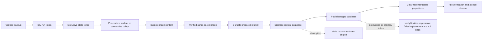

# State Store

Hostwright's local single-host state store is SQLite.

## Purpose

The state store persists desired state, observed snapshots, events, operation records, ownership records, health results, restart policy state, managed restart recovery records, operation recovery groups, and redacted diagnostics export data. Broader drift-specific records remain planned for later phases.

## Current State

Hostwright has a SQLite-backed state ledger inside `HostwrightState`. Apply uses that ledger to persist operation intent before runtime mutation, and cleanup uses ownership records plus live observation before deleting an exact eligible managed container.

Implemented:

- secure Application Support default plus explicit/environment-selected `SQLiteStateStore`
- private macOS configuration, state, runtime, metadata, backup, cache, and log layout
- deterministic path precedence and machine-readable `hostwright paths` status
- `0700` owned-directory and `0600` sensitive-file enforcement
- journaled, identity-bound `~/.hostwright/state.sqlite` migration with crash resume and active-writer refusal
- schema migrations
- desired manifest snapshot persistence
- observed runtime snapshot persistence
- event ledger
- operation ledger records for mutation safety
- operation statuses for recorded, succeeded, and failed apply/cleanup attempts
- ownership records for apply and cleanup decisions
- health check result records
- restart policy state records
- restart recovery records
- operation recovery groups and step records
- local redacted diagnostics export from existing state rows
- real temporary-database integration checks across multiple connections
- migration checksums, contiguous-history validation, and future-version refusal
- actionable corrupt/locked database failures
- a fixed Hostwright `application_id` that rejects foreign SQLite databases before persistent configuration
- authoritative `WAL`/`FULL` durability with macOS full-fsync barriers, defensive mode, untrusted schema, disabled double-quoted strings, no extension loading, and bounded resource limits
- serialized Hostwright writers with concurrent readers and bounded cross-process lock acquisition
- managed-transaction invariants that reject nested, external, or embedded transaction control and require rollback after cancellation, storage pressure, or execution failure
- read paths validate schema without applying migrations
- online SQLite backup with verified private catalogs
- full integrity, foreign-key, migration-ledger, required-table/index, UUID, enum, JSON-shape, and logical-record checks
- confirmation-bound atomic restore with pre-restore backup or corrupt-source quarantine
- projection-only repair for runtime observation and health results
- cross-process shared/exclusive access fencing and external maintenance journals
- recovery at every restore publication checkpoint, including the torn window before a publication checkpoint is durable
- executable pre-repair rollback when a committed repair database becomes unrecoverable
- atomic operation-group acquisition coverage across concurrent stores
- foreground daemon loop event and operation records

Not implemented:

- multi-action `hostwright apply`
- runtime mutation beyond create-missing-service, restart-policy-allowed managed start, restart-policy-allowed managed restart, and exact cleanup-eligible managed container delete
- broad cleanup, image cleanup, volume cleanup, or unmanaged cleanup
- drift planner
- GA lifecycle-count, extended hardware-fault, and long-soak qualification
- arbitrary SQLite page salvage or automatic repair of authoritative records
- launch agent or background daemon service

## Requirements

- SQLite implementation must be isolated inside `HostwrightState`.
- Migrations must be explicit.
- Writes must be transactional.
- Operation records must survive process restart.
- Secrets must not be stored in plaintext state.

## Path Policy

The default database is `~/Library/Application Support/Hostwright/state/state.sqlite`. Command-line `--state-db` wins over `HOSTWRIGHT_STATE_DB`, which wins over the default. No default writes occur in the repository, current working directory, XDG locations, or global system directories.

State-writing commands create the Hostwright-owned layout with mode `0700` and sensitive files with mode `0600`, independent of the caller's `umask`. Before use, the complete path chain must be safely owned and non-writable by group/other users; user-controlled symlinks, access-granting extended ACL entries, hard-linked sensitive files, wrong-owner files, special bits, and ambiguous paths fail closed. Tests resolve the same contract beneath unique temporary home directories.

The default path performs a journaled migration of a compatible `~/.hostwright/state.sqlite`. The migration records device/inode identity, synchronizes intent and directories, acquires an exclusive SQLite transaction, atomically renames, resumes after interruption, and preserves every unknown legacy file. Explicit and environment-selected databases never trigger an implicit legacy move.

The normative path table, environment hooks, command creation semantics, status values, and recovery procedure are in [Local Paths, Permissions, and Legacy Migration](../reference/local-paths.md).

## Migration And Compatibility Policy

`SQLiteStateStore.migrate()` is the only explicit migration path. Repository reads and writes validate the already-applied schema before accessing tables; they do not create a missing database, create `schema_migrations`, or apply migrations as a side effect.

Schema version 7 is the latest supported state schema. A database migrated by a newer Hostwright release fails closed with an incompatible-schema error. Hostwright does not downgrade state databases or silently convert provider ownership.

Each migration records a checksum in `schema_migrations`. Current builds accept the historical Phase 6 checksum for schema version 1 and record an algorithmic checksum for fresh migrations. If a known migration version has an unexpected checksum, Hostwright fails before reading or writing application records.

Hostwright-owned databases use SQLite `application_id` `0x48575254` (`HWRT`). A compatible legacy database with application ID zero is claimed only inside the explicit migration transaction after its ledger has been validated. A nonzero foreign application ID is rejected before journal-mode or other persistent configuration, and its database and sidecars are not modified.

Applied migration history must be a contiguous prefix beginning at version 1. A database that records a later migration while omitting an earlier version fails before schema-version reads, repository access, or migration. Hostwright does not infer, replay, or silently repair out-of-order migration history. A valid older contiguous prefix remains eligible for explicit forward migration.

## Schema

Version 1 creates:

- `schema_migrations`
- `projects`
- `desired_services`
- `observed_runtime_snapshots`
- `observed_services`
- `event_ledger`
- `operation_ledger`
- `ownership_records`

Version 2 creates:

- `health_check_results`
- `restart_policy_state`

Version 3 creates:

- `restart_recovery_records`

Version 4 creates:

- `operation_groups`
- `operation_group_steps`

Version 5 backfills legacy ownership rows that used the pre-adapter-guard runtime adapter sentinel.

Version 6 adds exact observed resource identifiers, observed network JSON, and ownership identity versions. Existing observed rows are backfilled with their legacy identifier and existing ownership rows remain identity version 1; new labeled resources are written as identity version 2.

Version 7 locks the v0.0.2 identity and recovery foundation:

- projects gain `resource_uuid`, `manifest_version`, `mutation_provider`, and `provider_generation`;
- ownership records gain `resource_uuid` and `resource_generation`;
- operation groups gain `fencing_token`, `intent_json_redacted`, `compensation_json_redacted`, and `verification_json_redacted`;
- unique indexes enforce resource identity;
- legacy projects, ownership rows, and operation groups receive deterministic UUID/fencing backfills so migration is idempotent; one unambiguous owned instance can retain its desired-service UUID, while duplicate legacy instances receive distinct UUIDs derived from their ownership record IDs;
- the migration checksum includes the non-SQL backfill implementation revision, so binaries with different transformation logic cannot claim the same schema-v7 migration;
- a project generation cannot silently change mutation provider.

Phase 04 completes the durable operation DAG/saga executor and Phase 08 completes unattended checkpoint recovery. Schema v7 records the required identity and intent surface now so later mutation paths cannot invent incompatible ledgers.

Normalized columns hold identifiers, project names, service names, timestamps, lifecycle states, operation status, event severity, restart status, recovery status, checkpoints, lock lease fields, rollback availability flags, and hashes.

JSON blobs hold ports, networks, mounts, environment snapshots, runtime capabilities, runtime identifiers, event payloads, operation payloads, ownership metadata, health command/output metadata, restart recovery completed-step metadata, and operation recovery metadata. Saga metadata, intent, compensation, and verification payloads are decoded, redacted by key/value, and re-encoded before persistence so redaction cannot corrupt their JSON structure. Invalid saga JSON fails before acquisition or terminal transition. Payload fields, runtime identifiers, failure messages, and manual recovery hints are redacted before persistence.

Desired environment snapshots never store resolved secret values. `secretEnv` entries persist only redacted markers in `env_json_redacted`; raw `keychain://<service>/<account>` labels and resolved values are not stored in desired-state rows.

## Integrity, Backup, Restore, Repair, And Diagnostics Export

`hostwright state integrity` classifies the selected database as:

- `healthy`: SQLite structure, foreign keys, schema v7 ledger/checksums, required tables and indexes, resource/fencing UUIDs, authoritative enums/JSON contracts, and reconstructible projections all pass;
- `degraded`: authoritative state is valid, but runtime-observation or health projections contain invalid enum/JSON/identity data that can be re-observed safely;
- `unrecoverable`: SQLite structure, foreign keys, migrations, required schema objects, or authoritative desired/ownership/operation/audit records are invalid.

The integrity command does not change the database. It reports the database SHA-256 and size when the file can be read, every check and affected-row count, the exact repairable projection tables, and one bounded recovery action. `PRAGMA integrity_check(100)` does not validate foreign keys, so Hostwright also runs `PRAGMA foreign_key_check` and its own schema/logical validators.

`hostwright state backup` uses SQLite's online backup API through a live source connection. It never copies a changing database with a filesystem copy. The destination is created as a `0600` file inside a `0700` unpublished directory, copied incrementally, normalized to sidecar-free `DELETE` journal mode, checked completely, hashed, and then published by an exclusive same-filesystem rename. Each final catalog directory contains exactly:

```text
backup-<uuid>/
├── manifest.json  # schema, purpose, time, digest, size, state version, source health
└── state.sqlite   # complete verified SQLite snapshot
```

Catalog reads revalidate directory/file ownership, modes, ACLs, link counts, exact contents, strict manifest fields, maximum manifest size, digest, database size, schema version, SQLite integrity, foreign keys, and logical contracts. Tampered, incomplete, rollback-only, or unreadable entries remain visible with `restorable: false`; they are never silently omitted. A catalog-root policy or read failure returns a real command error instead of fabricating a backup entry. Unknown partial evidence is preserved rather than recursively deleted.

Normal backup artifacts must be `healthy`. A pre-repair snapshot may be `degraded` only in the exact reconstructible projections and is marked rollback-only, never general-purpose restorable.

Restore has a mandatory two-step contract:

```bash
hostwright state restore --backup <id> --dry-run
hostwright state restore --backup <id> --confirm-restore <token>
```

The token binds the selected path, backup ID and digest, and current database digest/device/inode. A changed database or stale token fails before mutation. If a plan was generated while state was missing, confirmation also revalidates that any newly appeared path is a private, singly linked Hostwright state file; an unmanaged hard link, symlink, wrong-owner file, or wrong-mode file fails closed and remains untouched. A confirmed restore takes the exclusive Hostwright state fence, revalidates the backup and token, rejects source SQLite sidecars, creates a verified pre-restore backup when current state is healthy, creates and verifies a same-parent staged database, and requires that stage's digest and byte count to match the exact selected backup before publication. It records durable intent and publishes by atomic rename. If the current database is unreadable, its exact bytes are retained as a quarantine artifact. Hostwright never opens it as authority or invents replacement rows.

After publication, all runtime-observation and health projections are cleared because they describe a past runtime observation. Desired state, ownership, operation history, restart state, and audit events come from the selected verified backup. A new maintenance event records the restore and exact projection counts.



Repair also requires dry-run plus exact token confirmation. It is allowed only for a `degraded` report whose failures are confined to `observed_services`, `observed_runtime_snapshots`, or `health_check_results`. Hostwright creates a verified rollback-only snapshot, records a maintenance journal, deletes only the declared projection tables in one SQLite transaction, appends an audit event, and reruns the full integrity suite. If the committed repair database becomes unrecoverable before journal finalization, recovery preserves its exact bytes as failed evidence, restores the verified pre-repair snapshot, clears only the same recorded reconstructible projections, appends a distinct rollback event, and verifies healthy state before removing the journal. Any pre-existing authoritative/schema/foreign-key/SQLite failure refuses repair and directs the operator to a verified restore.

Ordinary repository access takes a shared per-database access fence, and writes additionally take the private writer fence. Restore and repair take the exclusive access fence. Existing state, fence, journal, staged, and displaced files are validated without changing their permissions before they are opened, moved, or removed; unmanaged, hard-linked, wrong-owner, wrong-mode, ACL-granting, or path-swapped files fail closed without being repaired in place. Restore records staging intent before creating its temporary SQLite copy, so interruption during copy or verification has an exact cleanup path. A pending maintenance journal blocks every ordinary read, write, and migration—including creation of a missing database—until `hostwright state recover` completes or rolls back the exact recorded checkpoint. Journals and their paths are strict, bounded, `0600`, identity-derived contracts; unsupported, duplicated, or path-injected fields fail closed and remain for inspection.

Direct database writes by other programs are unsupported. Hostwright serializes all writers that use `SQLiteStateStore`; another process running as the same macOS account can bypass the Hostwright fence by opening SQLite directly. Online backup can read a live WAL-mode source consistently, but filesystem-replacement restore and repair require the external writer to stop so Hostwright can take the exclusive fence and normalize the database to a sidecar-free portable form.

Diagnostics export is a local read-only command:

```bash
hostwright diagnostics [--state-db <path>] --bundle <path> [--project <name>] [--manifest <path>]
```

The command validates the already-applied schema, reads existing rows, applies Hostwright redaction before JSON rendering, and refuses to overwrite an existing bundle file. It does not observe runtime state, mutate runtime state, create or migrate a missing database, repair state, or upload telemetry.

The exported bundle can still contain sensitive local context such as project names, service names, paths, hostnames, resource identifiers, and redacted-but-contextual metadata. Review it before sharing.

For corrupt or non-SQLite state, generate a restore dry-run against a verified catalog entry. Confirmed restore preserves the unreadable original as quarantine evidence and atomically publishes the verified backup. Hostwright does not salvage arbitrary pages, invent ownership, delete authoritative rows, or treat path migration as database repair.

## Concurrency And Locking

Hostwright uses SQLite `FULLMUTEX`, a 250 ms busy timeout, `BEGIN IMMEDIATE` for transactional writes, and persistent cross-process coordination files. Reads hold the shared access fence for the complete SQLite connection lifetime. Writes hold that shared access fence plus an exclusive writer fence, so readers can proceed while Hostwright writers and checkpointers are serialized. Restore, repair, and recovery hold the exclusive access fence across validation, journal, rename/transaction, verification, and cleanup. A single 250 ms deadline bounds acquisition of the complete lock set.

Real tests verify concurrent readers, serialized writers, bounded lock refusal, uncommitted-write isolation, committed cross-connection visibility, mandatory rollback under cancellation and `SQLITE_FULL`, process termination with open and committed WAL transactions, 1,000 concurrent final-path symlink swaps, unsafe sidecar symlink/mode/hard-link refusal, non-mutating foreign-database refusal, live WAL backup consistency, selected-backup replacement races, every durable checkpoint, ordinary-error rollback after publication, repair rollback after unrecoverable post-commit state, and the torn windows between a copy/rename/transaction and its next journal update.

Read commands validate schema through read-only connections. Write commands run explicit migration before persistence, then use transactions for grouped writes. If another process holds an exclusive or write lock beyond the bounded timeout, Hostwright reports a locked state database instead of waiting indefinitely.

## SQLite Connection And Durability Policy

Authoritative state uses WAL journaling, `synchronous=FULL`, `fullfsync=ON`, and `checkpoint_fullfsync=ON`. Verified backup, restore-stage, rollback, and migration artifacts use sidecar-free DELETE journaling with `synchronous=EXTRA`. Both profiles require foreign keys, cell-size checking, secure deletion, in-memory temporary storage, disabled memory mapping, bounded cache/SQL/value/column limits, zero attached databases, defensive mode, untrusted schema, disabled double-quoted string literals, and disabled loadable extensions when the system SQLite library exposes that switch.

SQLite opens the final path with `NOFOLLOW`, records its validated device/inode identity before open, and revalidates the file set immediately after open. The database plus any `-journal`, `-wal`, and `-shm` sidecars must be invoking-user-owned, singly linked regular files with exact mode `0600` and no access-granting ACL. The policy is verified on every connection and is emitted by `state integrity` as `sqlite.connection-policy`; application ownership is emitted as `hostwright.application-identity`.

## Transaction Boundaries

Transactions wrap:

- migrations
- desired project/service snapshot writes
- observed runtime snapshot plus observed service writes
- grouped event appends
- operation record creation
- operation success/failure updates
- operation group acquisition and completion
- operation group step appends
- ownership record upserts

No transaction performs runtime mutation. Apply and cleanup write intent first, leave the transaction, call `RuntimeAdapter`, then record success or failure.

The connection authorizer denies transaction and savepoint opcodes inside a Hostwright-managed transaction. This prevents a multi-statement body from committing or replacing the outer boundary. Nested managed transactions and externally opened transactions are rejected. On cancellation, pressure, I/O failure, or body failure, Hostwright disables the cancellation callback long enough to perform mandatory rollback and verifies that the connection returned to autocommit mode before reporting the original error.

## Module Boundary

SQL is not part of the CLI, reconciler, runtime, health, networking, or observability modules. Runtime observation remains behind `RuntimeAdapter`; state persistence records adapter-shaped observed data but does not call the adapter itself.
