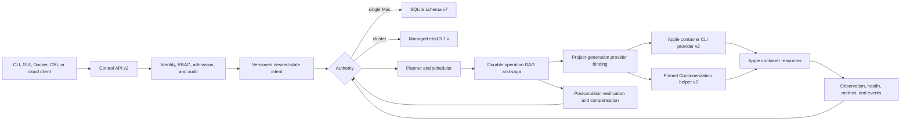

# Hostwright v0.0.2 All-In Implementation Plan

Status: active implementation contract

Release target: `v0.0.2`

Development version: `0.0.2-dev`

Milestone: [v0.0.2](https://github.com/hostwright/hostwright/milestone/10)

Master issue: [#284](https://github.com/hostwright/hostwright/issues/284)
Target GA gate: 2026-07-27
Execution cadence: one phase per day from 2026-07-13 through 2026-07-27

This plan supersedes the earlier phase plan. The old plan remains in `docs/IMPLEMENTATION_PLAN.md` as historical evidence; it is not the current product boundary. There are no product “non-goals” hidden behind wording. Every useful missing, partial, research-only, blocked, or misleadingly complete capability has one of three dispositions:

1. implement it in a named `v0.0.2` workstream;
2. implement a safe public-API fallback when the ideal mechanism depends on Apple or another external authority; or
3. reject only the unsafe or technically impossible mechanism while keeping the user outcome owned by a workstream.

The checked-in [issue manifest](issues.json) is the exhaustive, duplicate-safe work ledger: one master issue, 15 phase epics, and 167 child workstreams. Every record has a stable marker, GitHub number, parent, labels, milestone, and assignee. The generated [human-readable workstream index](WORKSTREAM_INDEX.md) lists every child. The roadmap governance gate rejects count, identity, parent, release, label, or assignee drift.

Capability wording and closure semantics are normative in the [gap and evidence taxonomy](GAP_TAXONOMY.md); current-versus-historical files are classified in [documentation status](DOCUMENT_STATUS.md).

## What `v0.0.2` Means

`v0.0.2` is intentionally a large breaking platform release while the project is young enough to change foundational contracts. The version number does not reduce the engineering standard. GA requires the complete supported scope, conformance reports, recovery evidence, signed distribution, and two clean release-candidate qualification runs. Until then:

- the binary reports `0.0.2-dev`;
- `hostwright capabilities --json` is the machine-readable source for present capability state;
- an accepted schema field or API operation must be executable and observable, not decorative;
- documentation, models, mocks, fixtures, research, blocked reports, and partial adapters never count as implementation evidence;
- compatibility claims name exact operating systems, hardware, runtime/framework versions, protocols, and clients actually tested.

## Platform Outcome

Hostwright `v0.0.2` is a dependable Apple-silicon container platform that provides:

- trusted one-command installation and reversible upgrades;
- complete local lifecycle through both Apple `container` and a pinned Containerization helper;
- durable desired state, resumable mutation, automatic recovery, and exact ownership;
- images, registries, secrets, supply-chain policy, storage, networking, DNS, ingress, and tunnels;
- an autonomous daemon, secure API, policy, audit, plugins, scheduling, optimization, and host-native accelerators;
- multi-Mac consensus and HA;
- real Kubernetes CRI/CNI/CSI/Helm and Docker/Compose/Podman/Testcontainers interoperability;
- native GUI, team/MDM workflows, optional cloud control, CI, and IDE integrations;
- release evidence that is reproducible, clean, versioned, and no broader than the tested surface.

## Locked Architecture

### Control and mutation flow



Each mutation is: validated intent → authorization → durable fencing token → checkpointed steps → provider call → observed postcondition → commit, compensation, or operator-visible hold. Runtime calls never occur inside a database transaction. A crash at any checkpoint is resumable and cannot make a second provider opportunistically take over the same project generation.

### Identity and ownership

- Every project, workload, operation, volume, network, secret binding, node, and cluster object has a Hostwright UUID.
- Apple resource names and labels are attributes and lookup aids, never primary identity.
- Ownership records bind UUID, project generation, provider, resource generation, and fencing token.
- Garbage collection requires positive Hostwright ownership, observed identity agreement, retention eligibility, and a finalizer/reclaim decision.
- Hostwright never deletes an unmanaged resource to make desired state “look clean.”

### State authority

- SQLite remains authoritative for a standalone Mac and node-local caches/ledgers.
- A Hostwright-managed, pinned etcd ensemble is authoritative for replicated cluster desired state.
- Hostwright does not invent a consensus algorithm.
- Loss of quorum makes cluster mutation read-only. Reads, diagnostics, and recovery guidance continue; unsafe availability does not outrank correctness.

### Runtime providers

- Runtime Provider API v2 defines observation, lifecycle, process control, streaming, images, networks, storage, cancellation, timeouts, errors, capabilities, and cleanup.
- Apple CLI and direct Containerization implementations run the same conformance suite.
- One project generation has one mutation provider. Provider migration is explicit, fenced, verified, and recoverable.
- Containerization runs behind a pinned out-of-process helper and versioned protocol so Swift package pinning and crashes do not destabilize the control plane.

### Kubernetes boundary

Hostwright does not pretend separate per-container VMs share Linux namespaces. Kubernetes pods use a Hostwright pod-sandbox VM with a guest agent. CRI lifecycle, CNI networking, CSI mounts, streaming, stats, and device behavior terminate at that real sandbox boundary.

### Extensions and accelerators

- Capability-limited WASI is the default extension model.
- Signed XPC services are allowed only for native Apple capabilities WASI cannot provide.
- Direct guest GPU/ANE passthrough is not fabricated without a supported public Apple API.
- The supported fallback is a signed, mutually authenticated, quota-aware host service for Metal, Core ML, and MLX with workload identity, cancellation, audit, and bounded data transfer.

## Breaking Contracts Locked in Phase 01

| Contract | v0.0.2 version | Compatibility rule | Migration rule |
| --- | ---: | --- | --- |
| Manifest | 2 | v2 is required for execution; versionless and v1 input are legacy. | `hostwright migrate preview` produces deterministic read-only v2 output; Phase 04 owns full semantic migration. |
| Control API | 2 | API N/N-1 is required once API v2 is released; current v1 requests fail explicitly. | Clients negotiate a version and receive stable unsupported-version errors. |
| Runtime Provider API | 2 | Provider capability negotiation is mandatory. | Projects stay bound to their generation’s provider until an explicit fenced migration. |
| Plugin ABI | 1 | Capability manifests and protocol version are checked before launch. | No ambient-privilege compatibility shim; incompatible plugins remain quarantined. |
| State schema | 7 | Newer schemas fail closed; migrations are contiguous and checksummed. | Deterministic UUID/fencing backfill; real upgrade/restore evidence is required. |

## Complete Limitation Register

“Current scope” describes `0.0.2-dev` today, not the eventual release. “When” is an implementation gate, not a support promise. The corresponding epic owns every child workstream listed in the issue manifest.

| Feature | Current scope | Why it is incomplete or research-grade | Implement for v0.0.2? | When / owning gate | If not, why or fallback |
| --- | --- | --- | --- | --- | --- |
| `brew install hostwright` | Does not exist. | No accepted Homebrew-core formula or trusted artifacts. | Yes, with two tracks. | Vendor tap P02; core submission P15. | Core acceptance is external; `brew install hostwright/tap/hostwright` is the guaranteed fallback. |
| Signed archive and `.pkg` | Unsigned developer archive evidence only. | Developer ID, notarization, stapling, Gatekeeper, installer, and clean-host evidence are absent. | Yes. | P02, requalified P15. | None. Publication stays blocked until trust gates pass. |
| Default paths and local install | Explicit paths and source builds. | Secure Application Support ownership, migration, rollback, PATH, and uninstall behavior are incomplete. | Yes. | P02. | None. |
| SQLite durability | Schema/migrations and narrow cold-copy evidence; schema v7 is newly locked. | Online backup/restore/repair, disk-full, corruption, file/symlink security, pressure, and soak proof are missing. | Yes. | P02. | SQLite remains single-host/node-local by design; cluster authority uses etcd. |
| Apple `container` provider | Partial observation and narrow create/start/restart/delete. | Structured codecs, capability negotiation, complete observation/lifecycle, normalization, cancellation, upgrades, and full conformance are incomplete. | Yes. | P03. | Exact current/previous tested minor only. |
| Containerization provider | Architecture only. | No pinned helper, versioned protocol, lifecycle implementation, isolation, or conformance evidence. | Yes. | P03. | No in-process unpinned framework coupling. |
| Manifest v2 | Version contract and migration preview exist; schema remains narrow. | Maintained YAML, complete workload schema, defaults, update semantics, and executable field coverage are missing. | Yes. | P04. | Unknown or unimplemented fields fail closed. |
| Full local lifecycle | Four narrow mutation actions plus observation/logs/cleanup. | No durable multi-action DAG, dependency reconciliation, complete commands, rolling update, or automatic rollback. | Yes. | P04. | None. |
| Exec/attach/copy/export/stats/follow | Mostly absent. | Process/TTY/stream/backpressure/cancellation semantics are not implemented. | Yes. | P04. | Unsupported calls return stable explicit errors until implemented. |
| Startup/readiness/liveness | Narrow allowlisted in-process health behavior. | Typed runtime probes, gates, budgets, rollout integration, and recovery are incomplete. | Yes. | P04 and P08. | None. |
| Images and builds | Local image references; no complete lifecycle. | Pull/build/push/tag/load/save/inspect/delete/prune, leases, and pressure GC are missing. | Yes. | P05. | None. |
| Registries | No production authentication. | Challenge flows, tokens, refresh, private registries, oversized/decompression defenses, and offline behavior are missing. | Yes. | P05. | None. |
| Secrets/Keychain | References, redaction, and opt-in read-only proof. | Production CRUD, access policy, rotation, config/secret providers, and full no-leak proof are missing. | Yes. | P05. | Secrets never enter argv, state, logs, diagnostics, crash bundles, or provenance. |
| Supply-chain trust | Digest string policy and unsigned local metadata. | Signatures, OCI referrers, SBOM binding, vulnerability policy, provenance verification, and tamper handling are absent. | Yes. | P05 and P15. | No “trusted” claim from digest syntax alone. |
| Persistent storage | Mount validation and state scaffolding. | Named volumes, provider SPI, snapshots, online restore, quotas, fencing, reclaim, orphans, and CSI-like semantics are missing. | Yes. | P06. | Unsafe host root/device mounts remain prohibited. |
| Project networking | Metadata/scaffolding and localhost-biased ports. | Owned networks, lifecycle, dual stack, TCP/UDP, sockets, host access, conflicts, and recovery are incomplete. | Yes. | P07. | Private Relay and OS permission constraints produce explicit diagnostics. |
| DNS and service aliases | Not implemented. | No owned resolver, lifecycle, collision, cache, or failure behavior. | Yes. | P07. | None. |
| Ingress, TLS, mTLS, policy | Research/design only. | Proxy lifecycle, certificate issuance/rotation/revocation, identity, ingress/egress enforcement, and cleanup are absent. | Yes. | P07. | No unauthenticated public exposure. |
| Secure tunnels | Research-only provider comparisons. | No Hostwright tunnel protocol, identity, asymmetric recovery, or provider SPI. | Yes. | P07. | Third-party providers remain optional plugins; secure Hostwright-to-Hostwright tunnel is built in. |
| Autonomous daemon | Foreground bounded development loop. | No LaunchAgent, unattended level-triggered mutation, config watch, budgets, maintenance, finalizers, or checkpoint recovery. | Yes. | P08. | Unattended behavior remains disabled until recovery evidence passes. |
| Observability | Events, bounded logs, local diagnostics. | OSLog, watches, metrics, traces, correlation, retention, support bundles, leak/soak qualification are incomplete. | Yes. | P08. | No silent telemetry or automatic upload. |
| Persistent Control API | One-shot local JSON subset. | No Unix socket, full parity, streams, watch recovery, authentication, backpressure, or compatibility window. | Yes. | P09. | Local offline operation remains primary. |
| Identity/RBAC/admission/audit | Local policy/team profile fragments. | Peer identity, least privilege, admission, tamper evidence, workload profiles, revocation, and complete audit are incomplete. | Yes. | P09. | Unauthenticated public control is prohibited. |
| Plugins/providers | Reviewed-local executable handshake with ambient account privilege. | No WASI sandbox, signed XPC mediation, capability grants, install/update/revoke/quarantine, or adversarial proof. | Yes. | P09. | Native plugins only where WASI cannot provide the capability. |
| Scheduler | Local advisory model only. | No actual requests/limits, hard filters, packing, fairness, topology, preemption, disruption, hysteresis, or exact-oracle qualification. | Yes. | P10. | None. Invalid or nondeterministic placement fails the gate. |
| Pressure/thermal/battery/sleep | Diagnostic facts and benchmark scaffolding. | No admission, reclamation, maintenance, energy policy, or live-hardware regression system. | Yes. | P10 and P15. | Policies remain explainable and operator-overridable within safety bounds. |
| GPU/ANE/Metal/Core ML/MLX | Research-only, no workload access. | Apple does not expose a supported direct guest passthrough path in the locked design baseline. | Yes, user outcome. | P10. | Implement authenticated host-native service; add direct passthrough only when a public API and conformance evidence exist. |
| Multi-Mac/HA | Research documents and local-only scheduling. | No membership, CA, consensus store, node agents, fencing, remote execution, volumes, discovery, failover, upgrades, or DR. | Yes. | P11. | Mutation stops on quorum loss; etcd supplies consensus. |
| Kubernetes/CRI/CNI/CSI/Helm | Explicitly unsupported today. | No real pod sandbox, guest agent, CRI services, guest topology, CSI adapters, translation, or conformance. | Yes. | P12. | No fake namespace compatibility; use real sandbox VMs. |
| Docker Engine API | Not implemented. | No negotiated endpoint, authenticated socket/context, stream semantics, endpoint matrix, or compatibility reports. | Yes. | P13. | Untested endpoints fail explicitly. |
| Compose/Podman/Testcontainers | Narrow import-only Compose subset. | Execution, update/export/loss reporting, Podman clients, and language matrices are absent. | Yes. | P13. | Platform-specific fields are never silently dropped. |
| GitHub Actions/IDE workflows | General source build only. | No supported CI action, Xcode, VS Code, or JetBrains integration/evidence. | Yes. | P13. | None. |
| Native GUI/menu bar | Requirements only. | No signed SwiftUI client, parity, topology, logs, recovery, accessibility, or update channel. | Yes. | P14. | GUI consumes Control API; it cannot bypass policy/state/runtime boundaries. |
| Team roles and MDM | Local profiles and approvals only. | No role lifecycle, managed deployment/policy, compliance, or enterprise qualification. | Yes. | P14. | None. |
| Optional cloud control | Research boundary only. | No tenant state, OIDC/SSO, outbound agents, isolation, consent, export/delete, or remote audit. | Yes, optional. | P14. | Local operation remains complete offline; agents connect outbound only. |
| Release qualification | Existing local baseline and unsigned evidence. | Physical matrices, security assessment, fuzzing, sanitizers, dependency/license gates, density, DR, upgrade lineage, soaks, and signed RCs are incomplete. | Yes. | P15. | No GA while any required evidence is blocked. |
| Intel and old macOS | Unsupported. | Apple container platform and target architecture require supported Apple silicon/macOS behavior; emulation would create a different unsafe product. | No. | Permanent platform boundary. | Publish exact compatibility and actionable diagnostics; do not pretend to emulate. |
| Private Apple APIs | Prohibited. | Unstable, unreviewable, entitlement-sensitive behavior cannot support a dependable platform. | No. | Permanent safety boundary. | Use public APIs, provider helpers, or host-native services. |
| Unsafe quorum writes | Prohibited. | They can acknowledge conflicting cluster state and destroy fencing guarantees. | No. | Permanent correctness boundary. | Safe read-only cluster mode until quorum returns. |
| Silent telemetry | Prohibited. | Violates privacy and makes trust impossible. | No. | Permanent privacy boundary. | Local observability by default; explicit informed opt-in for remote data. |
| Unmanaged destructive GC | Prohibited. | Ownership cannot be inferred safely from similarity or names. | No. | Permanent safety boundary. | Discover and quarantine; require adoption or explicit external cleanup. |

## Delivery Sequence

The daily dates are aggressive execution targets, not permission to weaken a gate. A phase closes only on clean implementation evidence; any unfinished work remains open and is reported as a schedule slip instead of being relabeled complete. Work stays sequential unless a prerequisite is already proven stable.

| Phase | Target window | Epic | Outcome | Depends on | Mandatory exit evidence |
| ---: | --- | --- | --- | --- | --- |
| 01 | 2026-07-13 | [#110](https://github.com/hostwright/hostwright/issues/110) | Truth reset, breaking contracts, migrations, capability report, roadmap/docs/GitHub governance. | None | Unit-contract, migration-upgrade, docs/site/build gates; every gap has an owner. |
| 02 | 2026-07-14 | [#120](https://github.com/hostwright/hostwright/issues/120) | Trusted installation, secure defaults, durable local state, upgrade/rollback/uninstall. | P01 | Distribution-artifact, migration-upgrade, security-assessment, corruption/disk/process tests. |
| 03 | 2026-07-15 | [#129](https://github.com/hostwright/hostwright/issues/129) | Conformant Apple CLI and pinned Containerization providers with safe binding/migration. | P01–P02 | Identical provider conformance, live-runtime, cancellation, failure, cleanup, upgrade evidence. |
| 04 | 2026-07-16 | [#140](https://github.com/hostwright/hostwright/issues/140) | Complete Manifest v2 and single-host app lifecycle on durable sagas. | P01–P03 | Real three-service install/update/failure/recovery/cleanup proof. |
| 05 | 2026-07-17 | [#152](https://github.com/hostwright/hostwright/issues/152) | OCI lifecycle, registries, Keychain/providers, signatures, SBOM, vulnerability and provenance policy. | P02–P04 | Registry/offline/tamper/bomb/no-secret-leak conformance. |
| 06 | 2026-07-18 | [#163](https://github.com/hostwright/hostwright/issues/163) | Persistent storage, snapshots, online backup/restore, quotas, fencing, reclaim, orphan GC. | P02–P04 | End-to-end hashes across replacement, crash, upgrade, restore, and cleanup. |
| 07 | 2026-07-19 | [#178](https://github.com/hostwright/hostwright/issues/178) | Networks, DNS, dual stack, ingress, TLS/mTLS, policy, secure tunnels and provider SPI. | P03–P04 | Permission, PF loss, sleep/wake, switch, rotation, partition, and cleanup evidence. |
| 08 | 2026-07-20 | [#194](https://github.com/hostwright/hostwright/issues/194) | Autonomous daemon, rollout/recovery, finalizers/GC, OSLog, watches, metrics, traces, support bundles. | P02–P07 | Kill-at-every-checkpoint suite, 10,000 cycles, 72-hour single-host soak. |
| 09 | 2026-07-21 | [#206](https://github.com/hostwright/hostwright/issues/206) | Persistent API, identity, RBAC, admission, tamper-evident audit, WASI/XPC extensions. | P01, P04, P08 | API N/N-1, unauthorized/adversarial plugin, backpressure, revoke/crash/hang tests. |
| 10 | 2026-07-22 | [#219](https://github.com/hostwright/hostwright/issues/219) | Resource scheduling, fair packing, topology, disruption, pressure/energy policy, accelerators. | P04, P08–P09 | One million generated cases; 10,000 exact-oracle comparisons; hardware/security evidence. |
| 11 | 2026-07-23 | [#235](https://github.com/hostwright/hostwright/issues/235) | Multi-Mac CA, managed etcd, node agents, fencing, remote placement/storage/discovery, HA and DR. | P02–P10 | Physical 3/5-node fault matrix, safe quorum loss, mixed versions, seven-day soak. |
| 12 | 2026-07-24 | [#247](https://github.com/hostwright/hostwright/issues/247) | Real pod sandbox, CRI/CNI/CSI, kubelet, resource/Helm translation, conformance reporting. | P03–P11 | `critest`, `csi-sanity`, CNI lifecycle and supported Kubernetes node/e2e results. |
| 13 | 2026-07-25 | [#257](https://github.com/hostwright/hostwright/issues/257) | Docker API/context, Compose, Podman, Testcontainers, Actions, Xcode/VS Code/JetBrains. | P03–P10 | Exact API/client/module matrices, explicit unsupported results, security and resilience. |
| 14 | 2026-07-26 | [#270](https://github.com/hostwright/hostwright/issues/270) | Signed SwiftUI app, parity/accessibility, team/MDM, optional offline-safe cloud control. | P08–P11 | Parity, accessibility, tenant isolation, penetration, consent, export/delete, disconnect tests. |
| 15 | 2026-07-27 | [#283](https://github.com/hostwright/hostwright/issues/283) | Full security, fuzz, sanitizer, supply-chain, performance, DR, docs, support, signed GA qualification. | P01–P14 | Two clean RC runs and every release gate below. |

## Phase Workstream Index

The child issue ranges below are not placeholders: each issue contains outcome, present evidence/gaps, contracts, dependencies, threat/failure model, evidence classes, recovery/rollback, docs, and strict closure rules. Exact titles, markers, labels, parents, and URLs are in `issues.json`.

- **P01 — [#103–#109](https://github.com/hostwright/hostwright/issues/110):** release/version truth; historical/current docs separation; gap/evidence taxonomy; UUID/provider binding/saga ADRs; contract versions; cross-repository docs/site/quickstart checks; evidence-gated GitHub closure.
- **P02 — [#111–#119](https://github.com/hostwright/hostwright/issues/120):** vendor tap; signed/notarized archives and `.pkg`; secure defaults; state backup/restore/repair; SQLite security; subprocess/process-tree hardening; real doctor; upgrade/rollback/repair/uninstall; SBOM/provenance.
- **P03 — [#121–#128](https://github.com/hostwright/hostwright/issues/129):** Apple codecs; capability negotiation; complete observation; normalized process/error/cancellation; Containerization helper; provider conformance; backend binding/migration; runtime-upgrade recovery.
- **P04 — [#130–#139](https://github.com/hostwright/hostwright/issues/140):** maintained YAML; full workload schema; operation DAG/saga; dependency reconciliation; lifecycle commands; exec/attach/copy/export/inspect/stats/follow; typed probes; update strategies; rollback; runnable apps.
- **P05 — [#141–#151](https://github.com/hostwright/hostwright/issues/152):** OCI lifecycle; registry challenges/tokens; Keychain CRUD; secret/config providers; digest locks; referrers; signatures; SBOM; vulnerability policy; provenance; leases/cache GC.
- **P06 — [#153–#162](https://github.com/hostwright/hostwright/issues/163):** named volumes; guarded mounts; provider SPI; snapshots; online backup/restore; quota/pressure; attachment fencing; reclaim/retention; orphan quarantine/GC; CSI-like internal semantics.
- **P07 — [#164–#177 and #84](https://github.com/hostwright/hostwright/issues/178):** project networks and ownership; DNS; TCP/UDP; dual stack; ports/sockets; host access; LAN policy; ingress; TLS; mTLS; ingress/egress policy; first-party tunnels; provider SPI; Local Network forwarding proof.
- **P08 — [#179–#193](https://github.com/hostwright/hostwright/issues/194):** LaunchAgent; unattended reconcile; config watch; restart budgets; maintenance; health rollout; rollback; checkpoint recovery; finalizers/leases; compaction; OSLog; events/watches; metrics; traces; support bundles.
- **P09 — [#195–#205](https://github.com/hostwright/hostwright/issues/206):** Unix-socket API; CLI parity; streams/watches; authentication; RBAC; admission; tamper-evident audit; workload profiles; WASI SDK; XPC boundary; plugin lifecycle/quarantine.
- **P10 — [#207–#218](https://github.com/hostwright/hostwright/issues/219):** requests/limits/reservations; hard filters; best-fit-decreasing; dominant-resource fairness; topology; preemption/disruption; hysteresis; explainability; thermal/battery/sleep; VM memory reclamation; accelerator inventory; Metal/Core ML/MLX service.
- **P11 — [#220–#234](https://github.com/hostwright/hostwright/issues/235):** membership; cluster CA; managed etcd; replicated intent; node agents; remote execution; fencing; placement; drain; discovery; remote volumes; leader leases; failover; mixed-version upgrades; DR.
- **P12 — [#236–#246](https://github.com/hostwright/hostwright/issues/247):** sandbox VM/agent; CRI RuntimeService/ImageService/streaming/logs/stats; kubelet; CNI; CSI; resource translation; Helm; scheduler/devices; conformance reports.
- **P13 — [#248–#256](https://github.com/hostwright/hostwright/issues/257):** Docker Engine API; authenticated socket/context; Compose execution/loss reporting; Podman; Testcontainers language matrices; GitHub Actions; Xcode; VS Code; JetBrains.
- **P14 — [#258–#269](https://github.com/hostwright/hostwright/issues/270):** SwiftUI/menu bar; CLI/GUI parity; operational visualization; accessibility; signed updates; roles/approvals; MDM; cloud service; PostgreSQL lifecycle; OIDC/SSO; outbound agents; remote audit/support consent.
- **P15 — [#271–#282](https://github.com/hostwright/hostwright/issues/283):** supported matrices; independent security assessment; fuzzing; ASan/TSan; dependency/SAST/secret/license gates; performance/density/energy; DR drills; upgrade lineage; docs/site/examples; support/governance/incidents; signed GA artifacts; Homebrew-core submission.

## Scheduler and Optimization Contract

Scheduling is deterministic and explainable. The order is locked:

1. validate workload requests, limits, reservations, priority, topology, policy, and accelerator claims;
2. remove nodes failing hard architecture, health, capacity, policy, affinity, volume, port, network, or accelerator filters;
3. order pending workloads by multi-resource best-fit-decreasing with a stable UUID tie-break;
4. score feasible nodes for fragmentation, dominant-resource fairness, topology spread, affinity/anti-affinity, data locality, energy/thermal state, and disruption;
5. preserve an existing valid placement unless improvement exceeds the anti-churn threshold;
6. if needed, choose a disruption-minimizing, budget-respecting preemption set and fence it before admitting replacement work;
7. return the chosen node plus filter failures, score components, alternatives, and preemption explanation.

Property tests require zero capacity/policy violations, starvation, nondeterminism, and unbounded churn across one million seeded cases. At least 10,000 small cases are compared with an exact solver/oracle. Performance target is 1,000 pending workloads across 100 nodes under one second p95 on the recorded reference Mac.

## Verification Constitution

Every child and phase runs the existing baseline:

```bash
swift build
swift test list || swift test --list-tests
swift test
scripts/integration.sh
scripts/grep-orchard.sh .
scripts/test.sh
scripts/lint.sh
```

The expanded system adds, as the owning phase makes each lane real:

- changed-code Swift coverage with no unexplained regression;
- supported ASan and TSan lanes;
- deterministic property and model-based state-machine tests;
- coverage-guided fuzzing for manifests, Apple output, APIs, plugins, archives, registries, streams, and guest protocols;
- dependency, license, secret, and static-security scanning;
- physical Apple-silicon runtime and power/thermal matrices;
- clean signing/notarization/install/upgrade/rollback/uninstall;
- 3/5-node chaos and mixed-version clusters;
- OCI, Kubernetes, CRI/CNI/CSI, Docker, Compose, Podman, and Testcontainers conformance;
- website typecheck/build/link validation and execution of every quickstart.

Required evidence classes are `unit-contract`, `local-integration`, `live-runtime`, `hardware-benchmark`, `distribution-artifact`, `migration-upgrade`, `security-assessment`, `resilience-chaos`, `multi-host`, `interop-conformance`, and `ux-accessibility`. Exact rules are in `docs/reference/testing-evidence.md` and `schemas/hostwright-evidence.schema.json`.

An issue closes only when:

- its runnable outcome and all child issues are complete;
- existing behavior and new normal, boundary, failure, recovery, migration, performance, compatibility, and cleanup paths pass;
- every declared evidence class passes from the exact clean commit;
- the result contains no blocker, skip, fixture/mock substitution for a real gate, or cleanup failure;
- the compatibility matrix and public docs match exact tested scope;
- the final comment records the stable evidence marker, commit, dirty state, OS, hardware, runtime/framework versions, commands, raw outcomes, failures, blockers, and cleanup;
- only the final `status:verification` PR uses `Closes #NN`.

## Release SLOs and Qualification Gates

| Area | v0.0.2 target |
| --- | --- |
| Cluster scale | 100 Macs and 10,000 declared workloads. |
| Scheduler | 1,000 pending workloads / 100 nodes under 1 second p95. |
| Local API | Reads under 100 ms p95; mutation acceptance under 250 ms p95 excluding runtime duration. |
| Planning | 1,000 resources under 2 seconds p95. |
| Reconciliation | Drift reconciliation begins within 5 seconds when healthy. |
| Failover | Leader failover under 15 seconds with zero acknowledged committed-state loss. |
| Performance regression | Stable microbenchmarks >5% or live hardware >10% fail unless a reviewed user-benefit tradeoff is recorded. |
| Lifecycle reliability | 10,000 lifecycle cycles and 72-hour single-host soak without duplicate resources, unmanaged mutation, or monotonic leaks. |
| Cluster reliability | Seven-day mixed-fault physical cluster soak with safe quorum-loss behavior. |
| Security/fuzzing | Independent assessment resolved; 24 aggregate fuzz CPU-hours per critical parser/protocol; supported sanitizer lanes clean. |
| Release | Two clean RC runs, zero unresolved P0/P1 defects, complete conformance, signed SBOM/provenance, and verified install through uninstall. |

Minimum lab cell is M1 with 8 GB. At GA, the supported matrix is Apple’s current and previous supported macOS major, current and previous tested Apple `container` minor, one exact Containerization pin per Hostwright release, current and previous supported Kubernetes minor, current and previous supported Docker API version, and the published client-family matrix. The matrix is evidence-driven and may narrow when an upstream combination is unsafe; it may never expand by assertion.

## External Constraints and Fallbacks

- Homebrew-core acceptance is outside Hostwright’s authority. The vendor tap is a release requirement; the core formula is submitted after GA artifacts meet Homebrew policy.
- Apple runtime/framework behavior can change. Providers are version-negotiated, pinned where necessary, and tested against current/previous declared versions.
- Direct guest accelerators wait for a supported public API. Host-native acceleration remains the implemented product path.
- Local Network permission, PF, Private Relay, sleep/wake, network switching, certificates, and asymmetric connectivity are treated as testable operating states, not documentation excuses.
- Cloud control is optional. A disconnected Mac retains complete local control, policy, state, audit, and recovery.

## Change Control

Foundational contracts may break during active `0.0.2-dev` work, but only through reviewed migrations and updated golden contracts. Once a phase contract is consumed by a later phase, breaking it requires an explicit architecture decision, migration update, regression proof, and roadmap/issue-manifest change. Scope is not silently deleted to meet a date: the release date moves, or the exact GA compatibility matrix narrows with evidence and an accountable issue.
