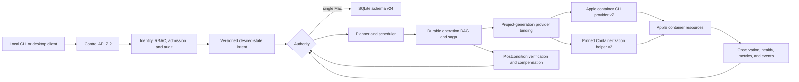

# Hostwright v0.0.2 Local Release Plan

The active release target is `v0.0.2`: a reliable single-Mac CLI, native desktop app,
and narrow Compose conversion workflow. Implementation remains on `0.0.2-dev`
until the release gates pass. Scope decision: [ADR 0015](../../design/adr-0015-reduced-local-release.md).

The ledger preserves one master issue, 15 phase epics, and 167 child workstreams.
Of the 78 issues open at the scope decision, 28 remain required and 50 are deferred.
Phases 01–09 remain closed with their historical evidence; later changes receive
regression coverage. A deferred closure is not completed implementation.

The original daily targets, 2026-07-13 through 2026-07-27, are historical. Delivery
now follows dependencies: scope reset → Phase 10 → Phase 13 → Phase 14 → Phase 15.
There is no replacement calendar deadline or promise for deferred work.

## Reduced Phase Requirements

| Phase / epic | Required for v0.0.2 | Deferred issues |
| --- | --- | --- |
| 10 / #219 | #207–#209 and #213–#215: local CPU/memory admission/release, hard filters, deterministic packing, stable placement, explanations and safe pressure deferral. | #210–#212 and #216–#218: fairness guarantees, topology optimization, automatic preemption, VM reclamation and accelerators. |
| 11 / #235 | Preserve development code and tests with explicit unsupported status. | #220–#235: all multi-Mac, consensus, remote operations, HA and cluster recovery requirements. |
| 12 / #247 | Preserve development contracts without Kubernetes compatibility claims. | #236–#247: sandbox VM, CRI/CNI/CSI, kubelet, Helm and conformance. |
| 13 / #257 | #250: existing Compose subset import/export/update planning, explicit loss reports, and real execution through normal Hostwright lifecycle commands. | #248–#249 and #251–#256: Docker socket/API, Podman, Testcontainers and dedicated CI/IDE integrations. |
| 14 / #270 | #258–#262: signed local SwiftUI/menu-bar app, manifest selection, services/health/logs/events, reviewed up/down/restart, accessibility and package upgrade/rollback. | #263–#269: team/MDM/cloud/SSO/fleet/remote support. Full CLI parity and automatic updates are removed from retained requirements. |
| 15 / #283 | #271–#281: bounded local qualification, security, recovery, upgrade lineage, docs, support, signed artifacts and vendor tap. | #282: Homebrew-core submission; physical cluster, broad client and multi-day qualification requirements are removed. |

The [issue manifest](issues.json) owns each retained issue's reduced acceptance
criteria and required evidence. The [generated index](WORKSTREAM_INDEX.md) lists
all historical identities and release dispositions. #284 remains the master gate.

## Locked Architecture

### Control and mutation flow

```mermaid
flowchart LR
    U["Local CLI or desktop client"] --> API["Control API 2.2"]
    API --> AUTH["Identity, RBAC, admission, and audit"]
    AUTH --> INTENT["Versioned desired-state intent"]
    INTENT --> STATE{"Authority"}
    STATE -->|"single Mac"| SQLITE["SQLite schema v24"]
    STATE --> PLAN["Planner and scheduler"]
    PLAN --> SAGA["Durable operation DAG and saga"]
    SAGA --> BIND["Project-generation provider binding"]
    BIND --> CLI["Apple container CLI provider v2"]
    BIND --> HELPER["Pinned Containerization helper v2"]
    CLI --> APPLE["Apple container resources"]
    HELPER --> APPLE
    APPLE --> OBSERVE["Observation, health, metrics, and events"]
    OBSERVE --> STATE
    SAGA --> VERIFY["Postcondition verification and compensation"]
    VERIFY --> STATE
```

Each mutation is: validated intent → authorization → durable fencing token → checkpointed steps → provider call → observed postcondition → commit, compensation, or operator-visible hold. Runtime calls never occur inside a database transaction. A crash at any checkpoint is resumable and cannot make a second provider opportunistically take over the same project generation.

### Identity and ownership

- Every project, workload, operation, volume, network, secret binding, node, and cluster object has a Hostwright UUID.
- Apple resource names and labels are attributes and lookup aids, never primary identity.
- Ownership records bind UUID, project generation, provider, resource generation, and fencing token.
- Garbage collection requires positive Hostwright ownership, observed identity agreement, retention eligibility, and a finalizer/reclaim decision.
- Hostwright never deletes an unmanaged resource to make desired state “look clean.”

### State authority

- SQLite remains authoritative for a standalone Mac and node-local caches/ledgers.
- Cluster state and managed etcd remain development-only; they are deferred from v0.0.2.
- Hostwright does not invent a consensus algorithm.
- Local release authority never depends on a cluster or a cloud service.

### Runtime providers

- Runtime Provider API v2 defines observation, lifecycle, process control, streaming, images, networks, storage, cancellation, timeouts, errors, capabilities, and cleanup.
- Apple CLI and direct Containerization implementations run the same conformance suite.
- One project generation has one mutation provider. Provider migration is explicit, fenced, verified, and recoverable.
- Containerization runs behind a pinned out-of-process helper and versioned protocol so Swift package pinning and crashes do not destabilize the control plane.

### Kubernetes boundary

Kubernetes and the proposed pod-sandbox VM, CRI, CNI, and CSI adapters are deferred. Existing guest-agent contracts do not establish a running VM or Kubernetes conformance.

### Extensions and accelerators

- Capability-limited WASI is the default extension model.
- Signed XPC services are allowed only for native Apple capabilities WASI cannot provide.
- Direct guest GPU/ANE passthrough is not fabricated without a supported public Apple API.
- Host-native Metal, Core ML, and MLX services are deferred and unavailable in this release.

## Breaking Contracts Locked in Phase 01

| Contract | v0.0.2 version | Compatibility rule | Migration rule |
| --- | ---: | --- | --- |
| Manifest | 3 | Manifest v3 is the active breaking contract; versionless and v1/v2 input are legacy and are accepted only by explicit migration preview. | `hostwright migrate preview` produces deterministic read-only v3 output, maps legacy flat resource values to both request and limit, and refuses legacy resource-less workloads that need a manual capacity declaration. |
| Control API | 2 (current protocol revision 2.2) | API N/N-1 is required once API v2 is released; current v1 requests fail explicitly. | Clients negotiate a version and receive stable unsupported-version errors. |
| Runtime Provider API | 2 | Provider capability negotiation is mandatory. | Projects stay bound to their generation’s provider until an explicit fenced migration. |
| Plugin ABI | 1 | Capability manifests and protocol version are checked before launch. | No ambient-privilege compatibility shim; incompatible plugins remain quarantined. |
| State schema | 24 | Newer schemas fail closed; migrations are contiguous, checksummed, and preserve historical authority. | Deterministic UUID/fencing backfill through v24; real upgrade/restore and Phase 10 recovery evidence is required. |

## Local Product Interfaces

- Local scheduling enforces explicit requests/limits, provider and ownership binding,
  deterministic packing and safe pressure deferral. Unsupported policies fail before
  mutation; no cross-project fairness, topology, preemption or accelerator support is claimed.
- Compose conversion retains its existing narrow field subset and loss reporting.
  Execution uses the generated Manifest v3 through ordinary confirmed lifecycle commands.
- Desktop uses authenticated Control API 2.2. Manifest selection, status, logs and
  events accompany reviewed up/down/restart. Confirmation binds the exact current
  plan; changed intent requires a fresh preview. No direct runtime or SQLite access.
- Retain the existing native split-view design, system typography and semantic colors.
  Verify keyboard/VoiceOver, light/dark appearance, normal/narrow windows and errors.
- Supported distribution contains the local CLI, signed app and required helpers.
  Deferred tools remain outside supported packaging and capabilities remain explicit.

## Verification and Closure

Every implementation PR runs `scripts/test.sh pr`, changed-behavior tests,
documentation checks and review. Release qualification additionally requires:

- ten live lifecycle cycles per supported provider and one checkpointed 30-minute
  physical-host soak; verify cancellation, interruption, recovery, reservation release,
  ownership and exact cleanup without duplicate resources or monotonic leaks;
- retained corpus replay plus five minutes of fuzzing per shipped critical parser/protocol;
- supported ASan/TSan lanes, dependency/license/secret/static-security gates and focused
  independent security review with no unresolved P0/P1 defects;
- real Compose-to-running-workload and desktop lifecycle/stream/reconnect tests;
- local backup/restore, upgrade lineage from preserved dev.11/dev.12 artifacts and
  downgrade refusal with one-generation rollback;
- executed quickstarts, website typecheck/build/link checks and truthful capability docs;
- one clean RC and independent signed-artifact install, reboot, upgrade, rollback,
  repair and uninstall verification; final-version artifacts qualify before publication.

Use macOS 26 arm64, Apple container 1.0.0/1.1.0 and Containerization 0.35.0 for
exact declared capabilities. Record actual OS builds and hardware. The physical
M4 Pro supplies runtime evidence; one macOS VM supplies clean-environment evidence.
No independent-hardware, M1/8-GB, cluster-scale, HA, Kubernetes or Docker-client
support follows from this lab. Publish measured local performance without broad
scale, density, energy or optimality guarantees.

The full evidence vocabulary remains available for historical and future work:
`unit-contract`, `local-integration`, `live-runtime`, `hardware-benchmark`,
`distribution-artifact`, `migration-upgrade`, `security-assessment`,
`resilience-chaos`, `multi-host`, `interop-conformance`, and `ux-accessibility`.
Required classes for this release are selected per issue; deferred lanes cannot
count as passed. Every result binds its actual source commit, environment and
artifacts. Blocked, skipped, dirty or cleanup-failed evidence fails a required gate.

Required issues close only with `status:verification`, clean final evidence, and
correct child closure. Deferred issues close only as `not_planned`, with the merged
scope-decision link and matching deferred children. Final implementation PRs use
`Closes`; intermediate work uses `Refs`. Never use implementation closure keywords
for a deferred issue. Historical release artifacts and evidence remain unchanged.

## Completion

Follow the [release process](../../release/RELEASE_PROCESS.md). Publish immutable
v0.0.2, verify downloaded artifact bytes and vendor-tap installation, and close
#283 and #284 only after the supported local workflows and all required evidence
are complete. `brew install hostwright/tap/hostwright` is the supported distribution
goal; unqualified Homebrew-core installation and acceptance are deferred.
